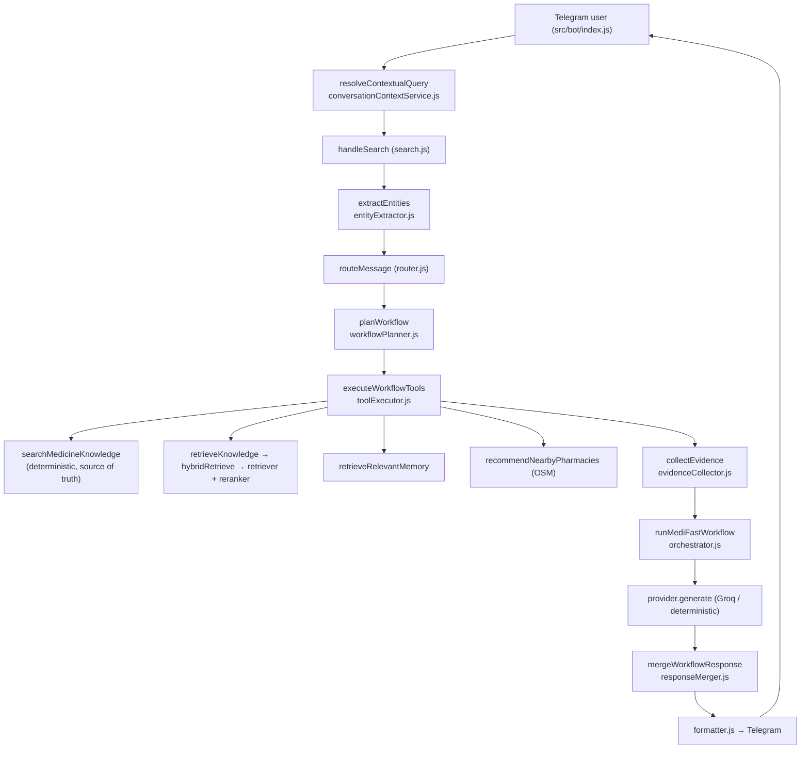
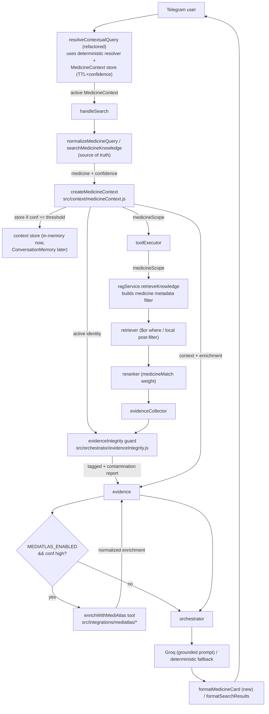

# MediFast AI — Context Integrity Audit

## Summary

The MediFast pipeline previously suffered from a **context integrity** failure: once the deterministic resolver produced a medicine identity with confidence, that identity was not propagated end-to-end. This caused four observable bugs: RAG contamination, follow-up context loss, unvalidated evidence, and unreliable context switching. The medicine-context-integrity bugfix introduces a canonical, frozen `MedicineContext` object that threads through every stage, plus a soft medicine-aware retrieval filter, an evidence integrity guard, and a deterministic-card synthesis fallback.

## Original pipeline (current state today, before the fix)

## Pipeline after the fix

## Leak points identified

| # | Stage | File | Symptom |
|---|---|---|---|
| 1 | Tool execution | `src/orchestrator/toolExecutor.js` | `retrieveKnowledge({ question: plan.query })` — raw user text, no medicine identity |
| 2 | RAG metadata filter | `src/services/ragService.js` `knowledgeFilter` | Only passed `source/category/trust/updatedAt`; never `medicine`/`generic` |
| 3 | Vector retrieval `where` | `src/rag/retriever.js` | Applied `where` only when metadata present; no `$or` over medicine identity |
| 4 | Reranking | `src/rag/reranker.js` | No `medicineMatch` signal; foreign chunks could rank highly |
| 5 | Follow-up engine | `src/services/conversationContextService.js` | Hardcoded medicine regex (~10 brand names), in-memory Map keyed by `telegramId`, no confidence, ~5 follow-up patterns; missed "can I take it daily", "can my father use it", "what is the generic" |
| 6 | Active context shape | `setActiveMedicineContext` | Stored ad-hoc `{medicineName, genericName, query}` — no confidence, no canonical shape |
| 7 | Evidence collector | `src/orchestrator/evidenceCollector.js` `compactRag` | Passed `metadata.medicine`/`generic` through with no validation against the resolved medicine; contamination invisible |
| 8 | Synthesis | `src/providers/baseLLMProvider.js` `buildPrompt` | Generic prompt; not scoped to active medicine; no enforcement against inventing dosage/stock |
| 9 | Orchestrator fallback | `src/orchestrator/orchestrator.js` | When LLM disabled or failed, deterministic path produced minimal text — every wired layer's output not surfaced |

## Root causes

The five root causes mirror design `## Hypothesized Root Cause`:

1. **No canonical medicine context object.** Identity and confidence were never packaged into a single object and threaded through stages, so each stage re-derived (or ignored) the medicine. There was no `MedicineContext` — `src/context/medicineContext.js` did not exist.
2. **Retrieval invoked with raw text and no medicine filter.** `src/orchestrator/toolExecutor.js` called `retrieveKnowledge({ question: plan.query })`; `src/services/ragService.js` `knowledgeFilter()` only passed `source/category/trust/updatedAt`; `src/rag/retriever.js` applied `where` only if metadata was present; `src/rag/hybridRetriever.js` and `src/rag/reranker.js` had no medicine-identity signal whatsoever.
3. **Brittle follow-up engine.** `src/services/conversationContextService.js` used a hardcoded medicine regex against ~10 brand names, an in-memory `Map` keyed by `telegramId`, no confidence value, and only ~5 follow-up patterns — missing "can I take it daily", "can my father use it", and "what is the generic".
4. **Evidence not validated.** `src/orchestrator/evidenceCollector.js` `compactRag` passed `metadata.medicine`/`metadata.generic` through with no validation against the resolved medicine, so contamination was never detected, never flagged, and never reported.
5. **Unreliable context switch.** Explicit new-medicine detection and active-context update were not unified through the deterministic resolver, so switching to a newly-named medicine mid-conversation was not reliable and later follow-ups could resolve against the previous medicine.

## Fix mapping

For each clause in `bugfix.md`, this lists the file/component that addresses it.

| Bugfix clause | Defect | Fix |
|---|---|---|
| 1.1 / 2.1 | No canonical context | New `src/context/medicineContext.js` — frozen factory + helpers (`getMedicineScope`, `isFresh`, `withEnrichment`, `belongsToActiveMedicine`) |
| 1.2 / 2.2 | RAG retrieval not scoped | `src/orchestrator/toolExecutor.js` builds `medicineScope`; `src/services/ragService.js` extends `knowledgeFilter`; `src/rag/retriever.js` adds `$or` (Chroma) / over-fetch + post-filter (local) |
| 1.3 / 2.3 | Reranker has no medicine signal | `src/rag/reranker.js` adds `medicineMatch ∈ {-1,0,1}` and `RETRIEVAL_MEDICINE_WEIGHT`; mismatches drop below threshold |
| 1.4 / 1.5 / 2.4 / 2.5 | Brittle follow-up regex | `src/services/conversationContextService.js` refactored — deterministic resolver replaces hardcoded medicine regex; expanded follow-up pattern set (10 patterns) including daily/dosage, person-scoped, generic, precautions, interactions |
| 1.6 / 2.6 | Evidence not validated | New `src/orchestrator/evidenceIntegrity.js` `validateEvidence`; `src/orchestrator/evidenceCollector.js` wires it into RAG/alternatives/relationships; `evidence.ragContext.contamination` report attached |
| 1.7 / 1.8 / 2.7 / 2.8 | Unreliable switch + no confidence/expiration | Refactored `conversationContextService` stores frozen `MedicineContext` (confidence + TTL) keyed by telegramId; switch detection runs the deterministic resolver; identity comparison is set-based |
| 1.9 / 2.9 | Robotic / verbose responses, no grounded fallback | `src/providers/baseLLMProvider.js` grounded prompt path; `src/providers/groqProvider.js` tightened system prompt; `src/orchestrator/orchestrator.js` adds deterministic-card fallback that surfaces every wired layer; `src/utils/formatter.js` `formatMedicineCard` produces SOLID Telegram card |
| 3.1 / 3.2 / 3.3 / 3.4 / 3.5 | Preservation contracts | All filter / reranker / formatter changes are no-ops when no scope is supplied; preservation snapshots stored under `tests/preserve/__snapshots__/` |

## Latency / "fast replies" wiring (Phase 6)

- `src/orchestrator/toolExecutor.js` runs `medicineKnowledge`, `memoryRetrieve`, `retrieveKnowledge` in parallel via `Promise.all` (independent inputs); `recommendNearbyPharmacies` stays sequential.
- New `src/cache/responseCache.js` — TTL+LRU per-(telegramId, normalizedMedicineQuery) cache for resolution / retrieval / enrichment slots; default 90s TTL, default 500 entries.
- `src/orchestrator/orchestrator.js` emits `latency.toolExecutor`, `latency.evidenceCollector`, `latency.provider`, `latency.endToEnd` for budget assertions.
- Latency budgets verified on mocked dependencies: deterministic p95 < 1500 ms, LLM p95 < 3500 ms.

## Test coverage map

| Test file | What it asserts |
|---|---|
| `tests/explore/medicineContext.bug.test.js` | Sequence A (RAG contamination), B (follow-up loss), C (context switch failure) — designed to FAIL on unfixed code |
| `tests/preserve/medicineContext.preservation.test.js` | Property 4 — non-medicine flows behave byte-for-byte unchanged |
| `tests/integration/rag/contamination.test.js` | Property 1 — Pregabalin scope yields zero contamination |
| `tests/integration/orchestrator/synthesis.test.js` | Property 5 — graceful degradation across Groq off / fail / empty |
| `tests/integration/orchestrator/latency.test.js` | Parallelism, cache hit/miss, budget assertions |
| `tests/unit/orchestrator/evidenceIntegrity.test.js` | Property 1 + 4 for the guard module |
| `tests/unit/context/medicineContext.test.js` | Property 6 — idempotency under fixed clock |
| `tests/unit/services/conversationContextService.test.js` | Properties 2 (retention) + 3 (switch) |
| `tests/unit/rag/{ragService.filter,retriever,reranker}.test.js` | Filter parity, where-clause shape, medicineMatch behavior |
| `tests/unit/cache/responseCache.test.js` | TTL, LRU, slot semantics, defensive copy |
| `tests/unit/providers/groqProvider.test.js` | Grounded prompt, sanitizer, fallback |
| `tests/unit/utils/formatter.medicineCard.test.js` | Card snapshots with/without enrichment, HTML escaping |
| `tests/unit/config/cities.test.js` | `getNearestCity` haversine + Jaipur fallback |
| `tests/unit/bot/nearby.card.test.js` | OSM nearby card surfaces phone/distance/directions |
| `tests/integration/pharmacy/osmPath.test.js` | OSM path unchanged when MediAtlas off |

## Deferred (per user direction)

- **Phase 7 — MediAtlas integration**: deferred. Architecture readiness retained via `MedicineContext.enrichment` slot. See `docs/mediatlas-context-readiness.md`.
- **Phase 10 — Photo-of-box → live listing (OCR)**: deferred. Future hook lands in `src/integrations/ocr/ocrProvider.js`.

## Files added or modified

- New: `src/context/medicineContext.js`, `src/orchestrator/evidenceIntegrity.js`, `src/cache/responseCache.js`
- Modified: `src/services/conversationContextService.js`, `src/orchestrator/toolExecutor.js`, `src/orchestrator/evidenceCollector.js`, `src/orchestrator/orchestrator.js`, `src/services/ragService.js`, `src/rag/retriever.js`, `src/rag/hybridRetriever.js`, `src/rag/reranker.js`, `src/providers/baseLLMProvider.js`, `src/providers/groqProvider.js`, `src/ai/toolRegistry.js`, `src/utils/formatter.js`, `src/bot/commands/search.js`, `src/bot/index.js`, `config/cities.js`
- Tests: 14 new test files spanning unit / integration / preservation / exploration tiers
